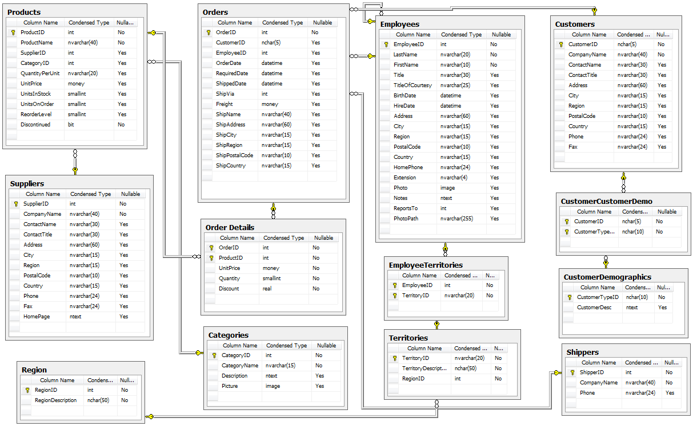

The goal of the task is to get basic knowledge of SQL functions and approaches to work with data in SQL.                                                     
 https://dev.mysql.com/doc/refman/5.7/en/function-reference.html                          
                                                                                          
 The course do not includes basic syntax explanations. If you see the SQL first time please read W3S which has quite good basis to start.                                       
 https://www.w3schools.com/sql/sql_syntax.asp      
 
## Scheme of Northwind database
The database is quite popular for Teaching Cases. You'll find the DB scheme in the Readme bellow.
 


## DB Assignments  [](https://travis-ci.org/AisBrestEdu/db-assignments)

To start DB Assignments please follow the next steps:
*  [Fork this repo](#user-content-how-to-fork-this-repo)
*  [Setup travis-ci to test the commits](#user-content-how-to-setup-travis-ci)
*  [Setup the work environment](#user-content-how-to-setup-work-environment)
*  [Implement assignments using TDD fashion](#user-content-how-to-implement-assignments-using-tdd-fashion)
*  [How to debug tasks](#how-to-debug-tasks)

### How to fork this repo
* Click the **Fork** button at the top-right corner of this page and the repository will be copied to your own account.
* Run `git clone https://github.com/<your-account>/db-assignments.git` from command line to download the repo.

### How to setup travis-ci
* Open [https://travis-ci.org/](https://travis-ci.org/) and sign in with your github account.
* Activate your forked repo **db-assignments**.
* Edit local README.md file and update all links (just replace all occurrences of `'AisBresEdu'` with your account name).
* Commit and push updated README.md to github:
```bash
  git add README.md
  git commit -m "Update the links"
  git push origin master
```
* Open https://github.com/AisBrestEdu/db-assignments and test the build icon. Now it will run all tests and update status once you push changes to github. Keep this icon green!


### How to setup work environment
* Download and install the latest [Nodejs](https://nodejs.org/en/download/stable/).
* Run `npm install` from you repository folder to download the required modules. All dependent modules will be located in the  *node_modules* folder.
* Install [MySQL](https://dev.mysql.com/downloads/mysql/5.5.html). **That's important:** The tests checked on Mysql 5.7 and Mysql 8.0 only.
* Default mysql user and password which we use for the tasks is "**root / password**", but you can override these via environmet variables. 
Example for linux: `USER_NAME=root PASSWORD=password HOST=localhost npm test`.
* [Restore **dumps/northwind.sql** dump](https://john-dugan.com/dump-and-restore-mysql-databases-in-windows/). To do that, in general case, you need to execute the command `mysql < [pathToTheFolder]/dumps/northwind.sql`.
* To connect to database and edit queries you can use any GUI like [dbeaver](https://dbeaver.io/) or [MySQL Workbench](https://www.mysql.com/products/workbench/).
* Open your favorite editor and complete tasks.
* Open your terminal and use `npm test` command to run all tests. You can run single file by passing it as argument `npm test ./test/sql-tasks.js`.
* The local repo folder has the following structure: <pre>
    node_modules - app dependences restored by `npm install` command, you can delete this folder and restore later again.
    task - folder with tasks modules, it's your main folder.
    test - folder with tests modules to verify the tasks completion.
</pre>

### How to implement assignments using TDD fashion
Now you are ready to implement assignments. Tasks modules are located in the **task** folder. Each module consists of several tasks for specified topic. Each task is usually a regular function:
```javascript
  /**
   *  Create a SQL query to return next data ordered by city and then by name:
   * | Employy Id | Employee Full Name | Title | City |
   *
   * @return {array}
   *
   */
  async function task_1_1(db) {
      throw new Error("Not implemented");
  }
```
Resolve this task using the following [TDD steps](https://en.wikipedia.org/wiki/Test-driven_development#Test-driven_development_cycle):
* Run unit tests and make sure that everything is OK and there are no failing tests.
* Read the task description in the comment above the function. Try to understand the idea. If you got it you are to write unit test first, but unit tests are already prepared :) Skip step with writing unit tests.
* Remove the throwing error line from function body
```javascript
     throw new Error('Not implemented');
```
and run the unit tests again. Find one test failed (red). Now it's time to fix it!
* Implement the function by any way and verify your solution by running tests until the failed test become passed (green).
* Your solution work, but now time to refactor it. Try to make your code as pretty and simple as possible keeping up the test green.
* Once you can't improve your code and tests are passed you can commit your solution.
* Push your updates to github server and check if tests passed on [travis-ci](https://travis-ci.org/AisBrestEDU/db-assignments/builds).
* If everything is OK you can try to resolve the next task.

### How to debug tasks
To debug tests you can use **Node inspector**. To install it just run `npm install -g node-inspector` in your terminal. Then follow next steps:
* Add `debugger;` to the first line of your task.
* Run your test file with `npm run test-debug ./test/sql-tasks.js`.
* In another terminal run `node-inspector` and copy link from the output.
* Open the link in your favorite browser. You should see Chrome Developers Tools like interface where you can debug your tasks.
* When you found and fix your issue, close the browser's tab with the debug tools, stop the node-inspector by pressing Ctrl-C, stop the test runner by pressing Ctrl-C, remove the `debugger;` from your task.

### How to debug (beginner's way)
There is an easier way to debug for beginners with free Visual Studio Code:
* Install VSC from https://code.visualstudio.com/
* Open project folder in VSC and follow the instruction from https://code.visualstudio.com/docs/runtimes/nodejs#_debugging-your-node-application to create a default `launch.json`
* Modify the `launch.json` in the IDE, set the properties "program" and "args" (empty "args" value run all tests, to run particular test specify this test file in "args"):
```
{
    "version": "0.2.0",
    "configurations": [
        {
           ...
           "program": "${workspaceRoot}/node_modules/mocha/bin/_mocha",
           ...
           "args": ["./test/sql-tasks.js"],
           ...
           "env": { 
              "HOST": "localhost", 
              "USER_NAME": "root", 
              "PASSWORD": "password", 
              "DATABASE": "northwind" 
           }
         },
         ...
     ]
}
```
* Click in the gutter to the left of the line number to set the breakpoint. Press `F5` to run debug.
* NOTE: The `launch.json` is stored in the `.vscode` project folder.


##Contribution
Feel free to contribute into this project. New tasks and katas are welcome.

